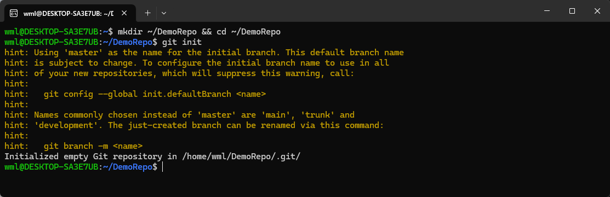
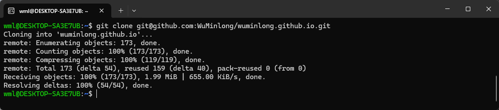
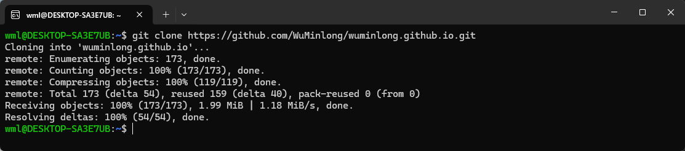

# Git: 创建仓库

Git 有两种创建仓库的方法：本地创建仓库和克隆远程仓库。

## 1. 本地创建仓库

本地创建仓库会在本地创建一个空文件夹，然后在该文件夹下初始化仓库。

### 1.1 创建并进入文件夹

```
mkdir ~/DemoRepo && cd ~/DemoRepo
```
### 1.2 初始化仓库

初始化仓库会在当前文件夹下创建一个 `.git` 目录，里面包含仓库的元数据和对象数据库。

```
git init
```

<div style={{textAlign: 'center'}}></div>

## 2. 克隆远程仓库

克隆远程仓库会将远程仓库的内容下载到本地，并自动关联到本地仓库。

克隆远程仓库有两种协议：SSH 协议和 HTTPS 协议。

:::tip
配置SSH密钥，可以参考 [GitHub: SSH密钥](./10.ssh.md) 教程
:::

### 2.1 SSH 协议

SSH 协议需要先配置 SSH 密钥，才能克隆远程仓库。

```
git clone git@github.com:WuMinlong/wuminlong.github.io.git
```

<div style={{textAlign: 'center'}}></div>

### 2.2 HTTPS 协议

HTTPS 协议不需要配置 SSH 密钥，直接克隆远程仓库。

```
git clone https://github.com/WuMinlong/wuminlong.github.io.git
```

<div style={{textAlign: 'center'}}></div>