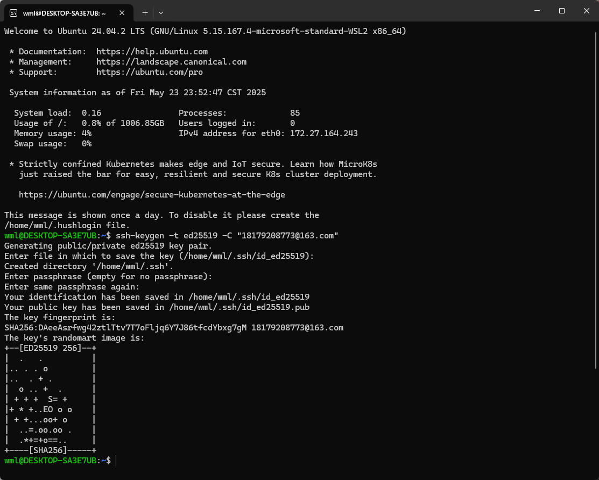
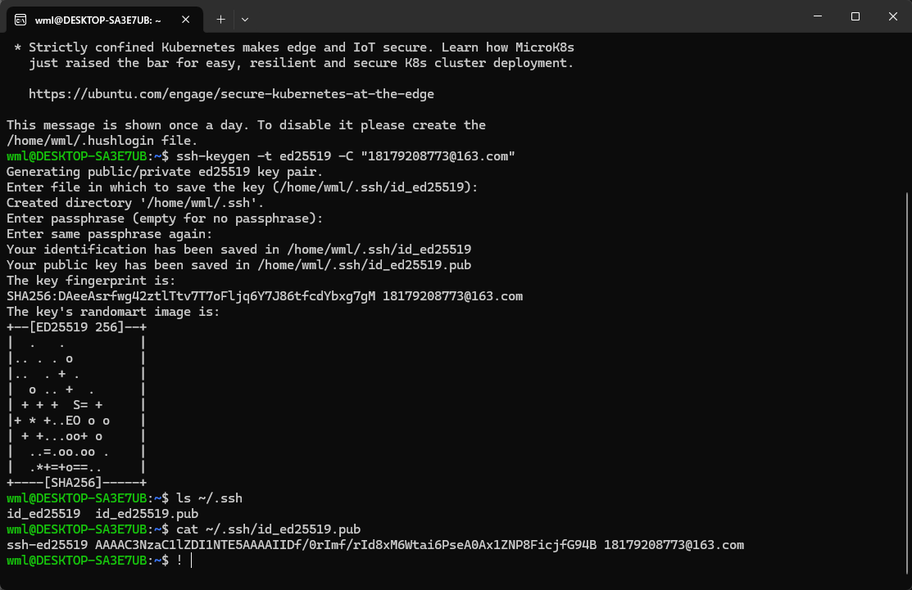
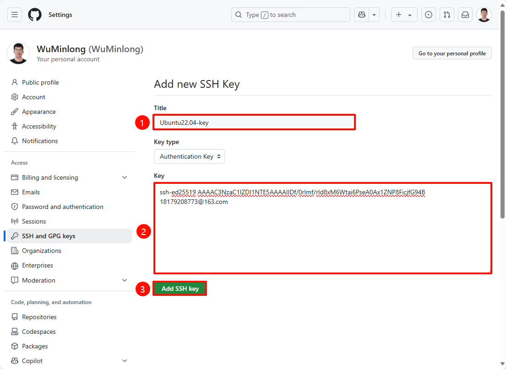
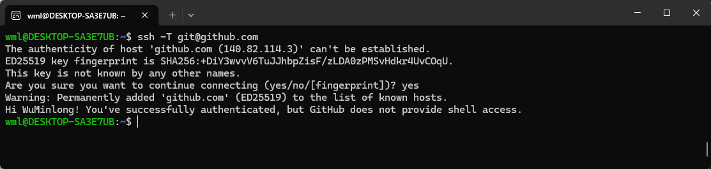

# GitHub: SSH密钥

:::tip
SSH 协议需要在 GitHub 上设置 SSH 公钥，并将公钥添加到 SSH 客户端
:::

## 1. 生成 SSH 密钥

使用以下命令生成 SSH 密钥：生成密钥需要确认信息，可以直接回车使用默认值。

```
ssh-keygen -t ed25519 -C "your_email@example.com"
```

- `-t`：指定密钥类型
- `-C`：指定注释信息

> **示例**
```
ssh-keygen -t ed25519 -C "18179208773@163.com"
```

<div style={{textAlign: 'center'}}></div>

## 2. 查看 SSH 密钥

命令执行完成后，默认在 `~/.ssh` 目录下生成两个文件：

- `id_ed25519`：私钥
- `id_ed25519.pub`：公钥

```
ls ~/.ssh
```

使用 `cat` 命令查看公钥内容：

```
cat ~/.ssh/id_ed25519.pub
```

> **示例**
```
ssh-ed25519 AAAAC3NzaC1lZDI1NTE5AAAAIIDf/0rImf/rId8xM6Wtai6PseA0Ax1ZNP8FicjfG94B 18179208773@163.com
```

<div style={{textAlign: 'center'}}></div>

## 3. 添加 SSH 公钥

### 3.1 登录账号

进入 [GitHub](https://github.com/) 网站，登录自己的账号。

<div style={{textAlign: 'center'}}></div>

### 3.2 新建 SSH 密钥

点击 [GitHub](https://github.com/) 网站的右上角头像，依次选择 `Settings` →  `SSH and GPG keys` →  `New SSH key` 选项。

<div style={{textAlign: 'center'}}></div>

### 3.3 输入 SSH 密钥

在 `Title` 输入框中输入密钥的标题，在 `Key` 输入框中粘贴公钥内容，最后点击 `Add SSH key` 按钮。

<div style={{textAlign: 'center'}}></div>

## 4. 测试 SSH 连接

在命令行中输入以下命令，测试 SSH 连接是否成功：

```
ssh -T git@github.com
```

:::tip
如果连接成功，会看到以下类似信息：

Hi WuMinlong! You've successfully authenticated, but GitHub does not provide shell access
:::

<div style={{textAlign: 'center'}}></div>