import Tabs from '@theme/Tabs';
import TabItem from '@theme/TabItem';

# Git : 安装说明

:::info

Linus Torvalds（林纳斯·托瓦兹）- Linux 与 Git 之父

- Linux 内核 (1991 年发布)
- Git 版本控制系统 (2005 年开发)

:::

Git 是一个强大且广泛使用的分布式版本控制系统 ( Distributed Version Control System, 缩写 DVCS )，由 Linus Benedict Torvalds 在 2005 年开发，最初用于管理 Linux 内核的开发。

它的设计目标包括速度、高效性、分布式协作和强大的分支管理，适用于从小型个人项目到大型企业级代码库。

## 1. 参考资料

- 官网 : [Git](https://git-scm.com/)

- 官方文档 : [Pro Git](https://git-scm.com/book/)

## 2. Git 安装

<Tabs
  defaultValue="Windows"
  values={[
    {label: 'Windows', value: 'Windows'},
    {label: 'Ubuntu', value: 'Ubuntu'},
  ]}>
  <TabItem value="Windows">

 1. 下载 Git

  进入 [Git 官网](https://git-scm.com/downloads) 下载 Windows 平台软件包。

  <div style={{textAlign: 'center'}}>
    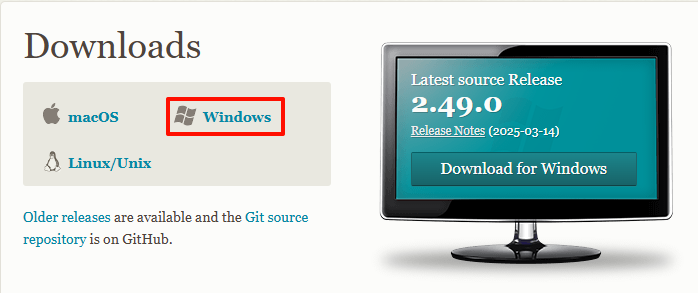
  </div>

 2. 安装 Git

  - 软件安装包
 
 以管理员身份运行 Git 的软件安装包。

  <div style={{textAlign: 'center'}}>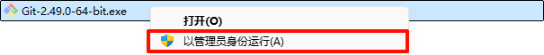</div>

  - 阅读协议

  阅读协议内容，然后点击 Next 进入下一步。

  <div style={{textAlign: 'center'}}>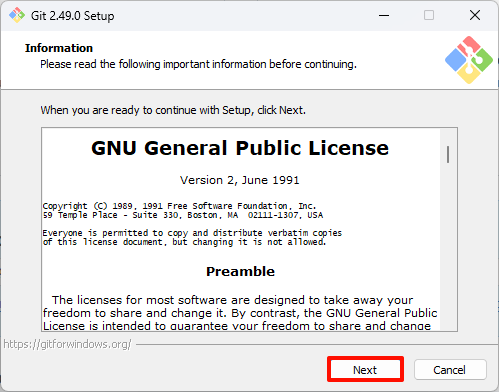</div>

  - 安装位置

  建议选择软件默认安装位置，然后点击 Next 进入下一步。

  <div style={{textAlign: 'center'}}>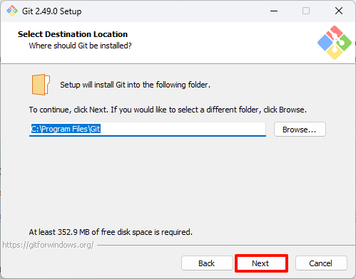</div>

  - 选择组件

  建议选择软件默认组件选项，然后点击 Next 进入下一步。

  <div style={{textAlign: 'center'}}>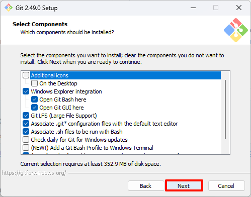</div>

  - 开始菜单项

  选择是否创建开始菜单项，然后点击 Next 进入下一步。

  <div style={{textAlign: 'center'}}>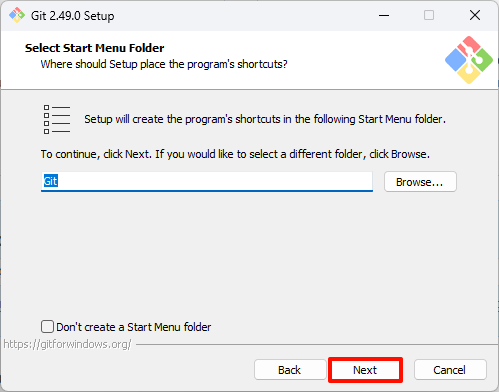</div>

  - Git默认器

  选择 Git 默认编辑器（默认是 Vim ,笔者选择 Visual Studio Code），然后点击 Next 进入下一步。

  <div style={{textAlign: 'center'}}>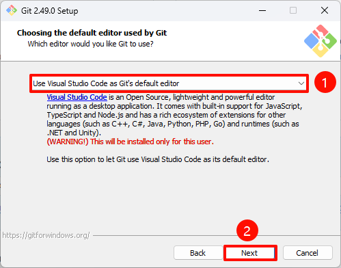</div>

  - 初始化分支名称

  选择新仓库默认初始化的分支名称（默认是 master，笔者修改成 main ），然后点击 Next 进入下一步。

  <div style={{textAlign: 'center'}}>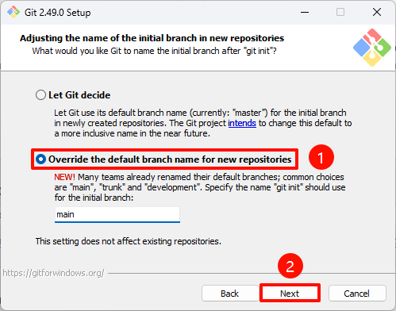</div>

  - Path 环境变量

  调整 Git 的环境变量，建议选择软件推荐的选项 ( 支持命令行和第三方软件使用 Git )，然后点击 Next 进入下一步。

  <div style={{textAlign: 'center'}}>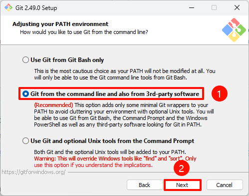</div>

  - SSH 执行文件

  使用 Git 自带的 OpenSSH 客户端，然后点击 Next 进入下一步。

  <div style={{textAlign: 'center'}}>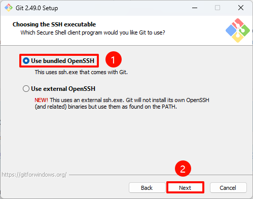</div>

  - HTTPS 传输

  选择 Git 默认推荐的选项，然后点击 Next 进入下一步。

  <div style={{textAlign: 'center'}}>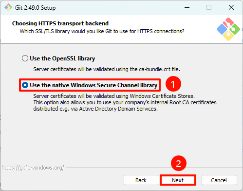</div>
  
  - 行尾符转换

  选择 Git 默认推荐的选项，然后点击 Next 进入下一步。

  <div style={{textAlign: 'center'}}>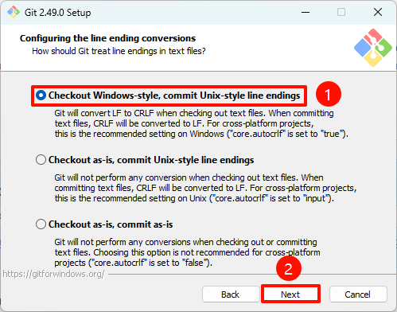</div>

  - 终端模拟器

  选择 Git 默认推荐的选项，然后点击 Next 进入下一步。

  <div style={{textAlign: 'center'}}>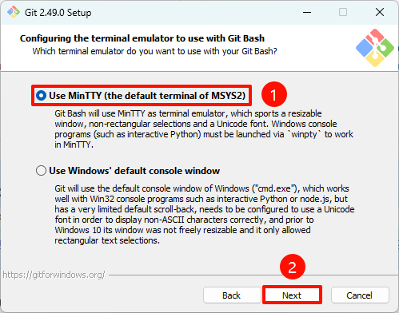</div>

  - 默认行为（git pull）

  选择 Git 默认推荐的选项，然后点击 Next 进入下一步。

  <div style={{textAlign: 'center'}}>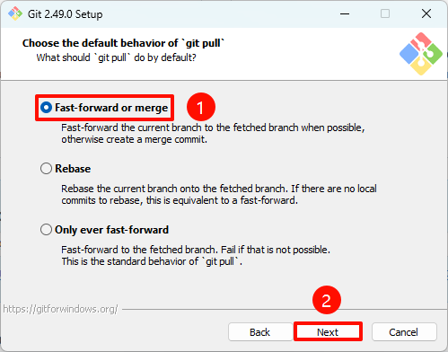</div>

  - Git 凭证助手

  选择 Git 默认推荐的选项，然后点击 Next 进入下一步。

  <div style={{textAlign: 'center'}}>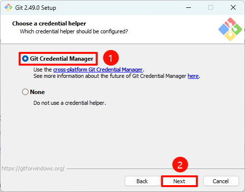</div>

  - 额外配置

  选择 Git 默认推荐的选项，然后点击 Install 进入正式安装。

  <div style={{textAlign: 'center'}}>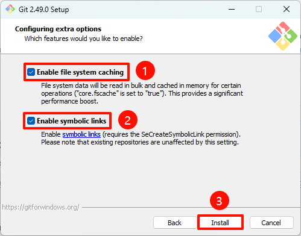</div>

  - 完成安装

  等待安装完成后，点击 Finish 完成安装。

  <div style={{textAlign: 'center'}}>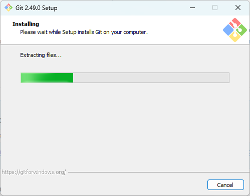</div>
  <div style={{textAlign: 'center'}}>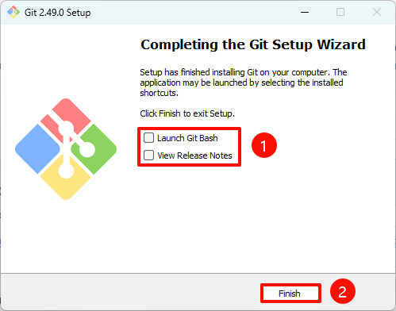</div>

  </TabItem>

  <TabItem value="Ubuntu">

  - 安装 Git

  ```
  sudo apt update
  sudo apt install git
  ```

  </TabItem>
</Tabs>

## 3. 验证安装

打开系统终端，输入以下命令查看 Git 版本。

  ```
  git --version
  ```